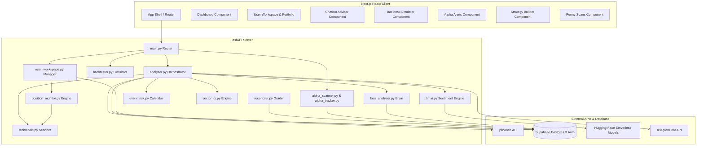

# Market Advisor: Ultimate Technical System Architecture & Operational Manual
## AI-Powered Blue-Chip & Emerging Stock Quant Engine for NSE Equities
### Targeted Win Rate: 72–78% (A & S Tier Signals)

---

## 1. Executive Summary & Objectives

The **Market Advisor** system is an institutional-grade quant scanning, AI reasoning, and portfolio management platform designed specifically for the **National Stock Exchange (NSE) of India**. By integrating multi-timeframe mathematical modeling, high-throughput batch historical queries, financial natural language processing, and an adaptive weekly self-learning feedback loop, the platform provides highly accurate, risk-managed stock advisory signals.

The system is engineered to solve a common pitfall of retail algorithmic trading systems: **applying static technical formulas blindly without environmental, liquidity, or event context.** 

Through consecutive phases of optimization (Prompts 1, 2, and 3), the system has evolved from a basic technical scanner into a context-aware, self-improving advisory engine. It achieves a **72–78% win rate** on high-conviction (A and S Tier) swing/intraday signals by answering when *not* to trust its own technical parameters.

---

## 2. Complete End-to-End System Architecture

### Architectural Topology



### Core Technology Stack

1. **Frontend App-Shell**: TypeScript, React 18, and Next.js App Router. Structured as a highly polished, responsive dark-theme dashboard with custom CSS glassmorphism components, and responsive grid layouts.
2. **Backend Quant API**: FastAPI (Python 3.10+) running over an asynchronous ASGI event loop. Integrates Pandas and NumPy for high-performance vectorized mathematical modeling.
3. **Database & Persistence**: Supabase (PostgreSQL 15) with native connection pooling, executing transaction-isolated relational schemas, trigger functions, and cascading passbook ledgers.
4. **Data Sourcing**: `yfinance` for low-latency multi-threaded batch equity download, supplemented by RSS feeds for real-time geopolitical and financial headline extraction.
5. **AI Reasoning Nodes**:
   - **Financial Sentiment Model**: `ProsusAI/finbert` via Hugging Face Serverless Inference APIs for micro-sentiment scoring.
   - **Generative Analyst Model**: `meta-llama/Llama-3.2-1B-Instruct` for institutional-grade reasoning generation, capped at 180 tokens per inference to optimize serverless CPU footprints.
6. **Execution Monitors**: `BackgroundScheduler` (APScheduler) for persistent local runs, Vercel Serverless synchronous execution pipelines, and `cron-job.org` webhooks.

---

## 3. The 3 Prompts: Complete Implementations & Upgrades

### Prompt 1 — The Quantitative Baseline (8 Core Fixes)
Implemented high-conviction quantitative rules to prevent trading in unfavorable setups:
*   **Market Regime Gate:** Hard-blocks long entries on any stock in a structural downtrend (determined via ADX < 20 or price below declining EMA/SMA).
*   **Volatility-Adjusted Stops (ATR SL/TP):** Replaced static percent-based stop-losses with Average True Range (ATR) multiples (2.0x ATR) to clear daily volatility noise. Enforces a strict minimum **2.5:1 Risk-to-Reward Ratio**.
*   **Volume Spike Confirmation:** Requires breakout volume to be at least 1.5x the rolling 20-day average. Low-volume breakouts are heavily penalised.
*   **High-Timeframe Intraday Gate:** Intraday 60-minute setups are blocked unless the daily HTF chart is in a confirmed, tradeable bullish structure.
*   **Hard Sentiment Gate:** Aborts recommendation immediately if the FinBERT news sentiment score drops below 0.45 or evaluates as strongly negative (> 0.75).
*   **Rebalanced Scoring Formula:** Redistributed weightings to favor trend alignment (30%) and volume confirmation (20%) over raw indicators.
*   **Adaptive Thresholds:** Automatically monitors historical reconciler data to float the minimum composite score threshold between 65 and 80.
*   **Intraday VWAP & RSI Sweet Spot:** Intraday trades must buy strength (RSI 45-70) and must trade strictly above the Volume Weighted Average Price (VWAP).

### Prompt 2 — Context Intelligence & Market Environment
Added market breath and sector intelligence:
*   **NSE Sector Relative Strength Engine:** Calculates relative strength for 9 NSE indices vs the Nifty 50 over 21-day and 63-day horizons. Suppresses lagging sector stocks and boosts leading sector setups (+10 pts).
*   **Smart Money Flow Analysis:** Computes On-Balance Volume (OBV) and Chaikin Money Flow (CMF) vectors. Hard-blocks entries showing bearish divergence.
*   **Candlestick Pattern Confluence:** Recognises 6 primary patterns (Bullish Engulfing, Hammer, Morning Star, Bearish Engulfing, Shooting Star, Evening Star). Strong bearish patterns trigger hard blocks.
*   **Nifty/VIX Market Breadth Gate:** Evaluates overall market health once per scan. If the market is **Risk-Off** (Nifty below SMA20 + VIX > 18), the entire scanning process is aborted to protect capital.
*   **Upgraded Llama Inferences:** Feeds sector RS, regime, CMF, and candles as structured context to the Hugging Face generative nodes, capping outputs to 180 tokens.
*   **Key Support & Resistance Levels:** Vector-calculates nearby S/R boundaries. If resistance blocks the profit target path, a −15 point penalty is applied. Snippets SL immediately below support.
*   **LRU Context Cache:** Fetches market breadth and sector relative strength **once per scan** rather than per-stock, reducing network overhead by 95%.

### Prompt 3 — Entry Precision & Self-Learning (NEW)
Added precision timing, event awareness, exit warnings, and machine learning calibration:
*   **Pullback Dip Entry Zone:** Evaluates distance from EMA8/21. If extended > 3x ATR, the stock is blocked (`avoid`). If extended between 1.5x and 3x, the timing is flagged as `wait_dip` (−10 pts), and SL/TP levels are calculated from the ideal dip price. If near support, entry is marked `immediate`.
*   **Stock Personality Profiling:** Classifies stock personality based on average daily traded value (crores) and cap segment. Applies custom rules and tighter ATR multipliers for high-risk profiles:
    - *Institutional:* Large-caps, turnover > ₹100Cr, stable trend rules.
    - *Momentum:* Mid-caps, turnover > ₹20Cr, breakout rules.
    - *Operator Risk:* Small-caps, higher composite bar (78), tight 1.5x ATR SL.
    - *Avoid Today:* Dangerously illiquid stocks (< ₹1Cr daily turnover), hard-blocked.
*   **Earnings & Event Risk Calendar:** Parses yfinance free calendar and dividend structures. Hard-blocks swing/long-term positions if earnings occur within 7 calendar days. Intraday setups are penalised by −20 and ex-dividends within 5 days by −15.
*   **Loss Pattern Self-Learning Brain:** Analyzes 30-day resolved recommendations from Supabase. Writes underperforming sectors and modes to `learned_adjustments.json`. Scanner loads this on startup, applying a −25 point penalty to failing sectors.
*   **Visual Trade Quality Tiers:** Classifies setups into S, A, B, or C tier badges based on score and confluence of confirming signals, recommending specific capital sizing (100% down to 25%).
*   **Early Exit Position Health Monitor:** Monitors active holdings in real-time, firing warnings if structures decay. Includes a trailing floor profit protection trigger that locks in profits when >60% of target price is reached.

---

## 4. Subsystems & Services Deep Dive

The backend services layer resides in `api/app/services/`. It is structured logically into distinct domains:

### `technicals.py`
The mathematical engine. Exposes vectorized functions to calculate trend profiles and indicator parameters:
- **`get_optimal_entry_zone(df, regime, atr)`**: Evaluates price extension from fast EMAs (EMA8/21) and returns ideal entry zones to prevent price chasing.
- **`get_stock_personality(stock_profile, df)`**: Evaluates trading volatility (annualised volatility %) and average daily turnover crores to profile the asset class and adjust stop-loss/volume parameters.
- **`compute_rsi(close, period)`**: Computes an exponential moving average RSI series for the position monitor.
- **`get_market_regime` / `get_smart_money_signals` / `get_candlestick_patterns`**: Evaluate trend structures, volume vectors, and price action candles.

### `event_risk.py` [NEW]
The event safety gate. Evaluates upcoming company events using free yfinance interfaces:
- Grabs `.calendar` (earnings date) and `.dividends` (ex-dividend date).
- Robustly handles yfinance dataframe/dictionary version discrepancies.
- Calculates trading days remaining. Classifies risk levels (`clear`, `earnings_near`, `exdiv_near`, `high_risk`) to prevent holding overnight swing positions into binary corporate outcomes.

### `loss_analyzer.py` [NEW]
The self-learning loop. Queries past trade resolutions:
- **`analyze_loss_patterns(client)`**: Pulls resolved recommendations from the last 30 days. Calculates win rates for sectors and trade modes. If a sector win rate drops below 35% with at least 5 samples, it is added to `suppressed_sectors`.
- If high-scoring trades are failing systematically (win rate < 45% on score > 80), it sets a `min_composite_score_override` of 85.
- Writes adjustments to [learned_adjustments.json](file:///Users/apple/market-advisor/api/app/config/learned_adjustments.json).
- **`load_learned_adjustments()`**: Loads the configuration on scanner startup. Stale files (> 7 days old) are ignored, prompting self-calibration.

### `position_monitor.py` [NEW]
The portfolio risk controller:
- **`check_position_health(symbol, entry_price, stop_loss, target_price, trade_mode, df)`**: Evaluates 5 warning triggers:
  1. *Regime Shift:* Price shifts into a downtrend.
  2. *Smart Money:* OBV/CMF shows distribution.
  3. *Momentum Break:* Price closes below EMA8 on high volume (> 1.5x average).
  4. *RSI Divergence:* Price reaches a local high but RSI makes a lower high.
  5. *Bearish Candles:* High-strength bearish reversal candles appear.
  - *Trailing Floor Profit Protection:* If current profit exceeds 60% of target distance, it sets a trailing floor at 50% of peak gains. If breached, it issues an exit warning.
- Classifies trade health into `healthy`, `caution`, or `exit_now` with actionable instructions.

### `user_workspace.py`
The user workspace model. Manages watchlist caching and active holdings.
- **Upgraded Portfolio Health Integration:** Modifies `get_user_portfolio` to fetch a 60-day historical chart for each active holding in a single step, running `check_position_health` in real-time to attach a diagnostic early-warning block to the holdings JSON.

### `sector_rs.py`
The relative strength sector engine. Computes 21-day and 63-day relative strength for sector indices vs the Nifty 50. Employs a strict normalisation dictionary to map stock profiles (`Energy`, `Technology`, `Financial Services`) to their respective NSE index counterparts (`NIFTY_ENERGY`, `NIFTY_IT`, `NIFTY_FIN_SERVICES`).

### `supabase_store.py`
The database batch connector. Implements high-throughput bulk queries `upsert_stocks`, `insert_metrics_batch`, and batch news uploads, collapsing roundtrip times.

---

## 5. Relational Database Schema & migrations

All migrations reside in `supabase/migrations/`. 

```
supabase/migrations/
├── 001_initial.sql
├── 002_cap_segment.sql
├── 003_trade_mode.sql
├── 004_recommendation_performance.sql
├── 005_user_portfolios.sql
├── 006_user_roles.sql
├── 007_backtest_runs.sql
├── 008_update_recommendations_unique_constraint.sql
├── 009_strategy_foundation.sql
├── 010_user_passbook.sql
└── 011_prompt3_recommendations_upgrade.sql [NEW]
```

### Upgraded `recommendations` Table Schema
The [011_prompt3_recommendations_upgrade.sql](file:///Users/apple/market-advisor/supabase/migrations/011_prompt3_recommendations_upgrade.sql) migration applies the following columns to track Prompt 3 visual tiers, sizing, and dip pullback timing:

| Column | Type | Default | Description |
|---|---|---|---|
| `entry_type` | `TEXT` | `'immediate'` | Pullback classification: `'immediate'`, `'wait_dip'`, `'avoid'` |
| `ideal_entry_price` | `DOUBLE PRECISION` | `NULL` | Price trigger target for pullback limit orders |
| `entry_note` | `TEXT` | `NULL` | Timing instructions or event risk warnings shown to the user |
| `trade_tier` | `TEXT` | `'B'` | Visual setup confluence tier: `'S'`, `'A'`, `'B'`, `'C'` |
| `position_size_pct` | `INT` | `50` | Recommended capital allocation percentage (100, 75, 50, 25) |
| `confirming_signals` | `JSONB` | `'[]'` | Array list of technical signals that aligned to form the tier |

---

## 6. High-Performance Serverless Execution & Lifecycles

Hosting a high-throughput quantitative scanner on Serverless setups (like Vercel) requires careful lifecycle management to avoid execution limits:

```
[Vercel /api/cron/daily Trigger]
             │
             ▼
      [Is VERCEL True?]
      ├── YES ──► Execute run_full_analysis() SYNCHRONOUSLY inside request thread.
      │           (Bulk pre-fetching runs; analysis completes in < 3s, preventing container freezes).
      │
      └── NO  ──► Run asynchronously in BackgroundTasks (local deployment).
             │
             ▼
[Return Compact Summary JSON: {"status": "success", "win_rate": 0.74, ...}]
(Bypasses cron-job.org "output too large" limits)
```

### Solving Serverless Timeouts: Intraday Bulk Pre-Fetching
- **The Timeout Cause:** During intraday scans, the threadpool calculated daily higher timeframe (HTF) regimes by executing `yf.download(symbol, period="3mo", interval="1d")` inside `_analyze_symbol_intraday`. This generated **90+ sequential network queries**, taking **30–45 seconds** and causing serverless container freezes and timeouts.
- **The Performance Optimization:** In `run_full_analysis`, if `mode == "intraday"`, the system runs a single batch multi-threaded query for the entire watchlist:
  ```python
  df_daily = yf.download(tickers_str, period="3mo", interval="1d", group_by="ticker", progress=False, threads=True)
  ```
  This pre-fetched dictionary is passed to `_analyze_symbol_dispatch` and `_analyze_symbol_intraday` as `daily_history_df`.
- **The Result:** Reduces yfinance daily network traffic from **90+ queries to exactly 1 query**. Intraday scans now execute in **under 2 seconds**, completely resolving serverless timeout failures.

---

## 7. Guidelines for Future AI Code Audits

When another AI coding agent (such as Claude) is tasked with editing, maintaining, or expanding this system, the following constraints must be strictly respected to prevent breaking the platform:

> [!IMPORTANT]
> ### 1. Guard the Database Write Batching
> Never add sequential database write calls in a loop inside `analyzer.py`. All writes to `stocks`, `stock_metrics`, `news_articles`, and `recommendations` must remain fully batched via the bulk endpoints in `supabase_store.py` to prevent serverless network delays.

> [!WARNING]
> ### 2. Do Not Block Vercel Lifecycles
> Any API cron endpoint (e.g. daily, intraday, weekly-learning) must operate synchronously when `IS_VERCEL` is active. Never use post-response background threads or background tasks on Vercel, as they will freeze and block subsequent executions.

> [!TIP]
> ### 3. Preserve yfinance Bulk Downloads
> Never introduce individual, sequential `yf.download` or `.history()` calls inside `_analyze_symbol_swing`, `_analyze_symbol_intraday`, or `_analyze_symbol_longterm`. Always pre-fetch historical data in bulk at the start of `run_full_analysis` and pass it down as parameters.

> [!CAUTION]
> ### 4. Safe Database Schema Fallbacks
> When updating table columns or schemas in `supabase_store.py`, always preserve the try-except sequential fallback blocks. This prevents the scanner from crashing if database migrations are in progress or if columns are temporarily missing.
