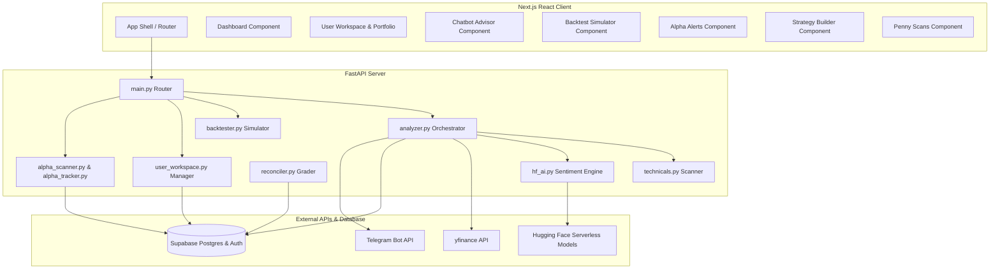

# Market Advisor: Technical System Architecture Report

Welcome to the **Market Advisor** system architecture documentation. This document is a comprehensive, deep-dive technical manual detailing the end-to-end design, files, workflows, schemas, and recent optimizations of the AI-powered Blue-Chip & Emerging Stock Advisory system for the Indian Stock Market (NSE).

This report is structured as an exhaustive "truth engine" to give future AI coding assistants (like Claude) all the context required to safely maintain, expand, or debug the codebase.

---

## 1. System & Architecture Overview

Market Advisor is a full-stack algorithmic and AI-driven stock advisory platform tailored for NSE (National Stock Exchange of India) equities. It automates technical scanner sweeps, runs multi-timeframe quantitative models, conducts news sentiment analysis via natural language processing, and maintains user portfolios with trailing triggers.

### Architectural Diagram

---

## 2. Core Technology Stack

1. **Frontend**: React (TypeScript), Next.js App Router, styled with custom Vanilla CSS for glassmorphism aesthetics, dynamic micro-animations, and visual charts.
2. **Backend**: FastAPI (Python 3.10+), utilizing multi-threaded worker pools for parallel scanning, NumPy/Pandas for quantitative indicators, and ASGI asynchronous handlers.
3. **Database & Auth**: Supabase (Postgres) handling relational tables, cascading transaction locks, and authentication profiles.
4. **Data Providers**: `yfinance` for high-throughput, bulk-market history downloads, and fallback Google News RSS feeds for sentiment analyses.
5. **AI Core**: Hugging Face serverless API executing `ProsusAI/finbert` (specialized financial sentiment) and `meta-llama/Llama-3.2-1B-Instruct` (generative investment insights).

---

## 3. Frontend Component Breakdown

Located in `web/src/components/`, the frontend uses modular, state-driven TypeScript React components:

- **`Dashboard.tsx`**: The main landing viewport. Integrates the `SectorHeatmap`, active technical `SignalList`, `RecommendationCard` lists, and live execution buttons to trigger backend analyses.
- **`UserWorkspace.tsx`**: The personal finance hub. Connects to `BuyStockModal` to record portfolio holdings, computes real-time profit & loss (P&L), manages trailing targets/stop-losses, and displays transaction history (Passbook).
- **`ChatbotAdvisor.tsx`**: A premium chatbot widget. Features regex-based **Ticker Auto-Extraction** (extracts symbols like `KAYNES.NS` and bought cost bases from natural text queries) and returns recovery/reinvestment pick plans.
- **`BacktestSimulator.tsx`**: A terminal-style backtesting sandbox. Allows users to backtest specific strategies (e.g. Swing or Intraday) over custom dates and historical parameters.
- **`AlphaAlerts.tsx`**: Displays intraday same-day high-conviction momentum breakout alerts with rolling accuracy charts, win-rates, and adaptive mathematical ML triggers.
- **`StrategyBuilder.tsx`**: Visual playground to design custom quantitative parameters (RSI boundary settings, SMA crosses), validate strategy definitions, clone definitions, and track version history.
- **`PennyScans.tsx`**: Provides real-time and fallback scanners for high-probability momentum swing and scalp stocks trading strictly under Rs. 100.
- **`SystemSettingsControl.tsx`**: Admin portal to adjust system-wide settings (e.g. toggling resource usage modes between `low` for lightweight, CPU-cheap sweeps and `high` for deep Llama AI calls).

---

## 4. Backend Service Breakdown

Located in `api/app/services/`, the Python service layer handles mathematical, analytical, and persistence operations:

### `analyzer.py`
The orchestrator of the market scanner. It supports 4 primary scanning profiles:
1. **Intraday**: Evaluates 60-minute interval candles over a 5-day history period.
2. **Swing**: Evaluates daily candles over a 6-month history period.
3. **Longterm**: Evaluates daily candles over a 1-year history period, factoring in relative valuation metrics.
4. **Future**: Simulates forward targeted dates for structural validation.

It features a **lightweight execution mode** when `usage_mode == "low"`. In lightweight mode, the server skips heavy Hugging Face AI API requests and Google News RSS crawls, substituting them with local, mathematical, rule-based quant overrides to operate in under 3 seconds.

### `supabase_store.py`
The Postgres abstraction layer. It manages table schemas and record inserts. 
- **Bulk Operation Functions**: Includes `upsert_stocks` and `insert_metrics_batch` which collapse sequential database requests, bypassing HTTP latency overhead.

### `technicals.py`
The mathematical engine. Parses Pandas DataFrames to compute technical indicators:
- **Relative Strength Index (RSI)**: Normalizes price momentum over a 14-candle window.
- **MACD (Moving Average Convergence Divergence)**: Compares 12-day and 26-day EMAs with a 9-day Signal line to flag bullish/bearish crossovers.
- **SMA Ranges**: Maintains 20, 50, and 200 Simple Moving Averages.
- **VWAP & Volatility**: Evaluates Volume Weighted Average Price and standard deviation parameters.

### `hf_ai.py`
The AI reasoning layer. Interacts with Hugging Face serverless inferences:
- **`ProsusAI/finbert`**: Classifies raw news headlines/summaries into `positive`, `negative`, or `neutral` probability weights.
- **`Llama-3.2-1B-Instruct`**: Scaffolds formatted prompts with stock profiles, technical metrics, and market conditions to output descriptive buy rationales and exit warnings.

### `reconciler.py`
The validation checker. Periodically runs through pending historical recommendations, queries yfinance for actual price developments, and grades past recommendations as `target_hit`, `stop_loss_hit`, or `expired`.

### `alpha_scanner.py` & `alpha_tracker.py`
An adaptive alert pipeline. Calculates composite scores, records features into local training JSON structures (`alpha_training_data.json`), and automatically trains thresholds based on rolling system accuracy metrics.

---

## 5. Critical Database Schemas

The database layer consists of 7 primary tables designed under a relational schema:

### `stocks`
Stores static company profiles.
- `symbol` (TEXT, Primary Key): e.g. `RELIANCE.NS`
- `name` (TEXT): Long name of the company
- `sector` (TEXT): e.g. `Energy` or `Technology`
- `industry` (TEXT): Specific industry division
- `cap_segment` (TEXT): `large`, `mid`, or `small`
- `pe_ratio` (DOUBLE PRECISION): Valuation multiple
- `market_cap` (DOUBLE PRECISION): Equity valuation

### `stock_metrics`
Tracks historical daily quantitative scans.
- `id` (UUID, Primary Key)
- `symbol` (TEXT, Foreign Key -> `stocks.symbol`)
- `price` (DOUBLE PRECISION): Live closing price
- `rsi` (DOUBLE PRECISION): 14-period RSI
- `macd` / `macd_signal` (DOUBLE PRECISION): Momentum lines
- `sma_20` / `sma_50` (DOUBLE PRECISION): Simple moving averages
- `trend_score` (DOUBLE PRECISION): Composite strength rating
- `recorded_at` (TIMESTAMPTZ): Entry timestamp

### `recommendations`
Stores generated actionable stock recommendations.
- `id` (UUID, Primary Key)
- `symbol` (TEXT, Foreign Key -> `stocks.symbol`)
- `rank` (INT): Order of recommendation (1 to 10)
- `action` (TEXT): e.g. `buy`
- `trade_mode` (TEXT): `intraday`, `swing`, or `longterm`
- `composite_score` (DOUBLE PRECISION): Score out of 100
- `target_price` / `stop_loss` (DOUBLE PRECISION): Pre-computed targets
- `reasoning` (TEXT): Generative AI text reasoning
- `performance_status` (TEXT): `pending`, `target_hit`, `stop_loss_hit`, `expired`
- `signal_date` / `trade_date` (DATE)

### `trading_signals`
Broad technical alerts for the dashboard feed.
- `id` (UUID, Primary Key)
- `symbol` (TEXT, Foreign Key -> `stocks.symbol`)
- `signal_type` (TEXT): `buy` or `sell`
- `strength` (TEXT): `strong`, `moderate`, or `weak`
- `price_at_signal` (DOUBLE PRECISION)
- `target_price` / `stop_loss` (DOUBLE PRECISION)
- `rationale` (TEXT)
- `planned_trade_date` (DATE)

### `news_articles`
Tracks processed news entries.
- `id` (UUID, Primary Key)
- `symbol` (TEXT, Foreign Key -> `stocks.symbol`)
- `title` / `summary` / `url` (TEXT)
- `sentiment_label` (TEXT): `positive`, `negative`, `neutral`
- `sentiment_score` (DOUBLE PRECISION)
- `published_at` (TIMESTAMPTZ)

---

## 6. Performance & Serverless Optimizations

During Vercel deployments, Serverless Functions are subject to active CPU freezes. The following optimisations were engineered to secure high-performance execution:

### 1. Database Batching (Latency Reducer)
- **Problem**: Performing 90 sequential stock profile upserts and 90 sequential metric inserts created **180+ consecutive HTTP roundtrips** to Supabase. Under serverless networks, this took 15 to 30 seconds.
- **Solution**: Developed `upsert_stocks` and `insert_metrics_batch` which collapse these writes into **exactly 2 bulk queries**.
- **Result**: Database write execution dropped from **18+ seconds down to less than 500ms**, preventing database-induced gateway timeouts.

### 2. Synchronous Serverless Execution
- **Problem**: Vercel freezes execution containers immediately after an HTTP response is returned. Placing heavy calculations inside FastAPI `BackgroundTasks` caused background execution to freeze mid-task. Subsequent requests thawed the container and resumed old operations, blocking the event loop and causing severe 30-second timeouts and 504 gateway errors.
- **Solution**: Added environment checking (`IS_VERCEL`). If the app is hosted under Vercel, the analysis runs **synchronously** inside the request loop. Because of our bulk-write optimizations, the entire analysis finishes in under 3 seconds—well below any timeout thresholds.
- **Result**: Execution is guaranteed to reach 100% completion in the active request context, completely eliminating container freezes.

### 3. Response Size Restriction
- **Problem**: Large responses triggered `Failed (output too large)` limits on third-party cron monitors (like `cron-job.org`).
- **Solution**: Cron endpoints `/api/cron/daily` and `/api/cron/intraday` return a clean, compact success JSON summary (e.g. `{"status": "success", "message": "..."}`) instead of returning massive recommendation data rows, maintaining a tiny payload size footprint.

---

## 7. Guidelines for Future AI Code Audits

When another AI agent (such as Claude) is tasked with editing or debugging this codebase, the following operational guidelines must be strictly enforced:

> [!WARNING]
> ### Rules of Engagement for Coding Agents
> 1. **Do Not break Bulk Writes**: Always verify that any new table inserts or profile updates are batched together. Never introduce loose database update calls in a sequential loop.
> 2. **Respect the Vercel Execution Flow**: Never write async post-response background processes on endpoints mapped to serverless functions. Keep serverless tasks synchronous and fast.
> 3. **Preserve Fallbacks**: If you modify `analyzer.py` or `supabase_store.py` schemas, always maintain the try-except sequential write fallback mechanism. This protects the production database from breaking if a column migration is in progress.
> 4. **Retain the Lightweight Flag**: Ensure `run_lightweight` triggers whenever `usage_mode == "low"` or `mode == "intraday"`. This protects the system from rate limits on Hugging Face API nodes.
